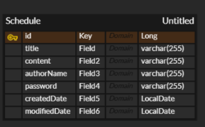

# 일정 관리 프로젝트
### Lv 1. 일정 생성

- [ ]  **일정 생성**
    - [ ]  일정 생성 시, `일정 제목`, `일정 내용`, `작성자명`, `비밀번호`, `작성/수정일`가 포함되어야 함
        - [ ]  `작성/수정일`은 날짜와 시간을 모두 포함한 형태
    - [ ]  각 일정의 고유 식별자(ID)를 자동으로 생성하여 관리
    - [ ]  `작성일`, `수정일` 필드는 `JPA Auditing`을 활용하여 적용
    - [ ]  API 응답에 `비밀번호`는 제외

### Lv 2. 일정 조회

- [ ]  **전체 일정 조회**
    - [ ]  `작성자명`을 기준으로 등록된 일정 목록을 전부 조회
        - [ ]  `작성자명`은 조회 조건으로 포함될 수도 있고, 포함되지 않을 수도 있음
        - [ ]  하나의 API로 작성
    - [ ]  `수정일` 기준 내림차순으로 정렬
    - [ ]  API 응답에 `비밀번호`는 제외
- [ ]  **선택 일정 조회**
    - [ ]  선택한 일정 단건의 정보를 조회
        - [ ]  일정의 고유 식별자(ID)를 사용하여 조회
    - [ ]  API 응답에 `비밀번호`는 제외

### Lv 3. 일정 수정

- [ ]  **선택한 일정 수정**
    - [ ]  선택한 일정 내용 중 `일정 제목`, `작성자명`만 수정 가능
        - [ ]  서버에 일정 수정을 요청할 때 `비밀번호`를 함께 전달
        - [ ]  `작성일`은 변경할 수 없으며, `수정일`은 수정 완료 시, 수정한 시점으로 변경되어야 함
    - [ ]  API 응답에 `비밀번호`는 제외

### Lv 4. 일정 삭제

- [ ]  **선택한 일정 삭제**
    - [ ]  선택한 일정을 삭제
        - [ ]  서버에 일정 삭제을 요청할 때 `비밀번호`를 함께 전달
---

## ERD


---

## 일정 관리 프로젝트 명세 API
- Base URL : http://localhost8080

---
### Lv1. 일정 생성
- URL : `/schedules`
- Method : `POST`
#### Request Body(JSON)
```
{
    "title" : "일정 제목",
    "content" : "일정 내용",
    "authorName" : "작성자명",
    "password" : "비밀번호"
}
```
|이름|데이터타입|설명
|---|:-------|:---
|title|String|일정 제목
|content|String|일정 내용
|authorName|String|작성자명
|password|String|비밀번호

#### Response Body(JSON)
- 성공응답 : 201 Created
```
{
    "id" : number,
    "title" : "일정 제목",
    "content" : "일정 내용",
    "authorName" : "작성자명",
    "createdDate" : "작성 일자",
    "modifiedDate" : "수정 일자"
}
```
|이름|데이터타입|설명
|----|:------|:----
|id|Long|schedule 고유 ID
|title|String|일정 제목
|content|String|일정 내용
|authorName|String|작성자명
|createdDate|LocalDate|작성 일자
|modifiedDate|LocalDate|수정 일자

- XXX 에러 응답: 500 Internal Server Error
```
none
```
| 이름 | 데이터타입 |설명
|----|:------|:---
|    |       |
---
### Lv2. 일정 조회
#### 전체 일정 조회
- 파라미터 존재 시 URL : `/schedules?authorName=작성자명`
- 파라미터 존재 X시 URL : `/schedules`
- Method : `GET`

#### Request Body(JSON)
```
none
```
| 이름 | 데이터타입 |설명
|----|:------|:---
|    |       | 

#### Response Body(JSON)
- 성공응답 : 200 OK(등록된 정보가 없을 시 → [ ] 반환)
```
[
    {
        "id" : number1,
        "title" : "일정 제목1",
        "content" : "일정 내용1",
        "authorName" : "작성자명1",
        "createdDate" : "작성 일자1",
        "modifiedDate" : "수정 일자1"
    },
    
    {
        "id" : number2,
        "title" : "일정 제목2",
        "content" : "일정 내용2",
        "authorName" : "작성자명2",
        "createdDate" : "작성 일자2",
        "modifiedDate" : "수정 일자2"
    }
]     
```
|이름|데이터타입|설명
|---|:--------|:--
|id|Long|schedule 고유 ID
|title|String|일정 제목
|content|String|일정 내용
|authorName|String|작성자명
|createdDate|LocalDate|작성 일자
|modifiedDate|LocalDate|수정 일자

#### 선택 일정 조회
- URL : `/schedules/{scheduleID}`
- Method : `GET`

#### Request Body(JSON)
```
none
```
|이름|데이터타입|설명
|---|:--------|:---
|   |         |    

#### Response Body(JSON)
- 성공응답 : 200 OK
```
{
    "id" : number,
    "title" : "일정 제목",
    "content" : "일정 내용",
    "authorName" : "작성자명",
    "createdDate" : "작성 일자",
    "modifiedDate" : "수정 일자"
}
```
|이름|데이터타입|설명
|---|:-------|:---
|id|Long|schedule 고유 ID
|title|String|일정 제목
|content|String|일정 내용
|authorName|String|작성자명
|createdDate|LocalDate|작성 일자
|modifiedDate|LocalDate|수정 일자

- XXX 에러 응답 : 500 Internal Server Error
```
none
```
| 이름 | 데이터타입 |설명
|----|:------|:---
|    |       |

---

### Lv3. 일정 수정
- URL : `/schedules/{scheduleID}`
- Method : `PATCH`

#### Request Body(JSON)
```
{
    "title" : "일정 제목",
    "authorName" : "작성자명",
    "password" : "비밀번호"
}
```
| 이름         | 데이터타입  |설명
|------------|:-------|:---
| title      | String |일정 제목
| authorName | String |작성자명
| password   | String |비밀번호

#### Response Body(JSON)
- 성공응답 : 200 OK
```
{
    "id" : number,
    "title" : "일정 제목",
    "content" : "일정 내용",
    "authorName" : "작성자명",
    "createdDate" : "작성 일자",
    "modifiedDate" : "수정 일자"
}   
```
|이름|데이터타입|설명
|---|:-------|:---
|id|Long|schedule 고유 ID
|title|String|일정 제목
|content|String|일정 내용
|authorName|String|작성자명
|createdDate|LocalDate|작성 일자
|modifiedDate|LocalDate|수정 일자

- XXX 에러 응답 : 500 Internal Server Error
```
none
```
| 이름 | 데이터타입 |설명
|----|:------|:---
|    |       |

---
### Lv4. 일정 삭제
- URL : `/schedules/{scheduleID}`
- Method : `DELETE`

#### Request Body(JSON)
```
{
    "password" : "비밀번호"
}
```
| 이름       | 데이터타입  |설명
|----------|:-------|:---
| password | String |비밀번호
#### Response Body(JSON)
- 성공응답 : 204 No Content
```
none
```
| 이름 | 데이터타입 |설명
|----|:------|:---
|    |       |

- XXX 에러 응답 : 500 Internal Server Error
```
none
```
| 이름 | 데이터타입 |설명
|----|:------|:---
|    |       |
